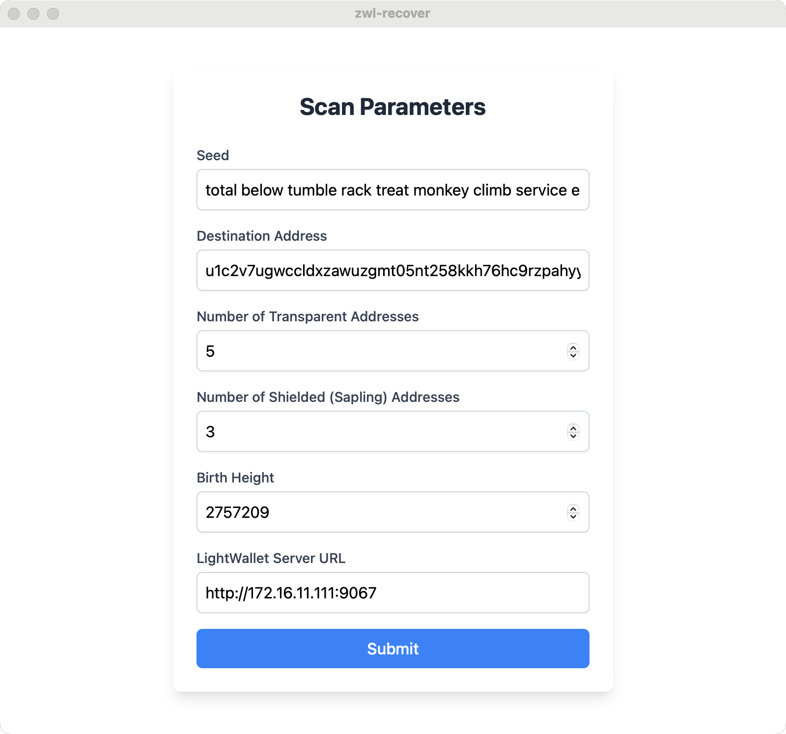

## ZWL Recovery Tool

You need:
- Seed phrase
- Number of Transparent Addresses
- Number of Shielded (Sapling) Addresses
- Wallet Birth Height
- Lightwalletd Server URL (by default https://zec.rocks)
- and finally the destination address

The tool will sweep all the funds it finds and
send them to the target address

> It can take a **REALLY LONG TIME** to run this tool
depending on the birth height and number of shielded
addresses.



## Build

Make sure you have the required software
mentioned [here](https://v1.tauri.app/v1/guides/getting-started/prerequisites/)

Then,

```
git clone https://github.com/hhanh00/zwl-recover.git
cd zwl-recover
git clone https://github.com/hhanh00/warp.git
cd warp
git submodule update --init
cd ..
npm i
npx tauri icon
npx tauri build
```
